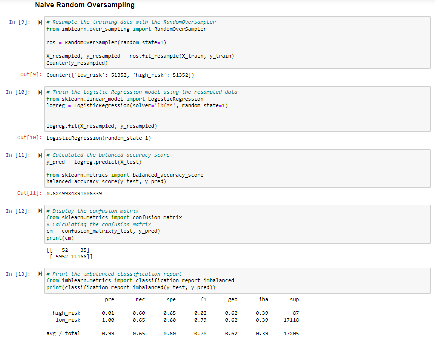
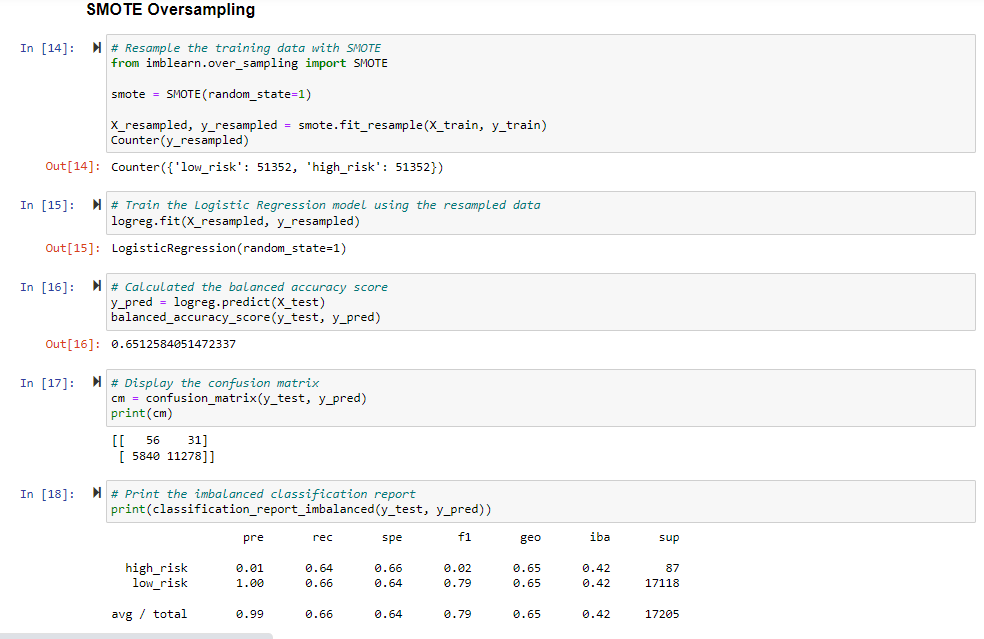
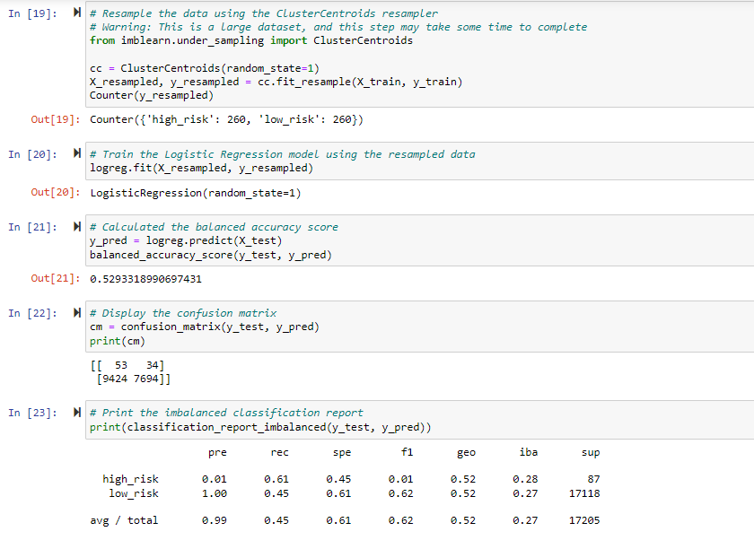
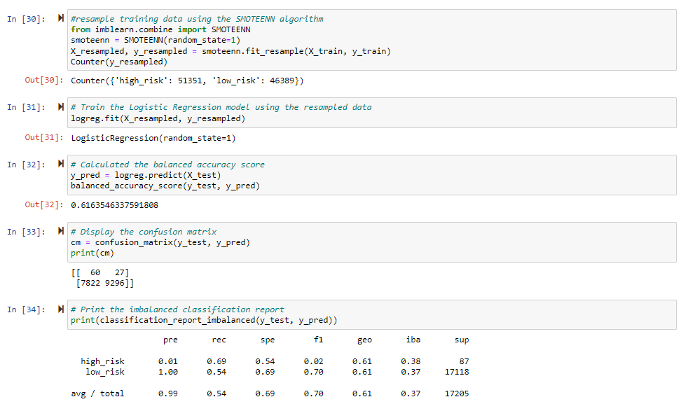
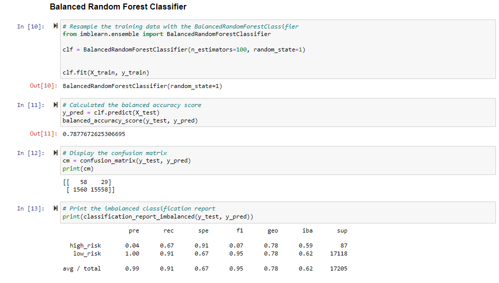
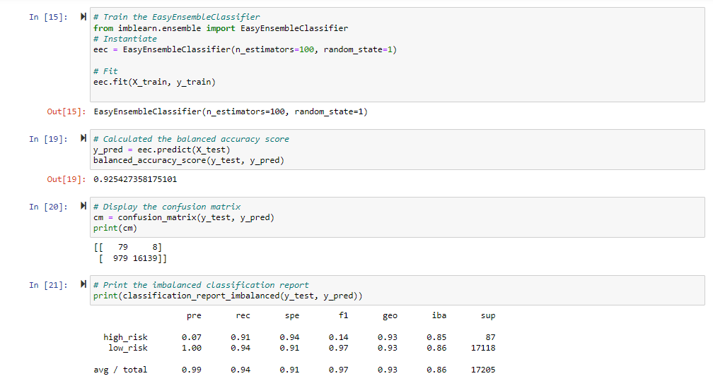

# Credit Risk Analysis

## Project Overview

Using a dataset from LendClub, a peer-to-peer lending services company, multiple machine learning approaches were taken to create models to predict credit risk. 

## Resources

### Data Sources 

LoanStats_2019Q1.csv
	

### Software 

Jupyter Notebook

## Results

The following methods were used to predict risk with their results shown below:

### RandomOverSampler

* Accuracy:  62.5%
* High Risk 
  * Precision: 1%
  * Recall: 60%
* Low Risk
	* Precision: nearly 100%
	* Recall:  65%

### SMOTE

* Accuracy:  65.1%
* High Risk 
  * Precision: 1%
  * Recall: 64%
* Low Risk
	* Precision: nearly 100%
	* Recall: 66%

### ClusterCentroids

* Accuracy:  52.9%
* High Risk 
  * Precision: 1%
  * Recall: 61%
* Low Risk
	* Precision: nearly 100%
	* Recall:  45%

### SMOTEENN

* Accuracy:  61.6%
* High Risk 
  * Precision: 1%
  * Recall: 69%
* Low Risk
	* Precision: nearly 100%
	* Recall:  54%

### BalancedRandomForestClassifier

* Accuracy: 78.8% 
* High Risk 
  * Precision: 4%
  * Recall: 67%
* Low Risk
	* Precision: nearly 100%
	* Recall:  91%

### EasyEnsembleClassifier

* Accuracy:  92.5%
* High Risk 
  * Precision: 7%
  * Recall: 91%
* Low Risk
	* Precision: nearly 100%
	* Recall:  94%

## Summary

The models all show weak precision in determining high credit risk with the EasyEnsemble being the most precis at 7%. This model does detect 91% of high credit risk but with such low precision, even with this being the most successful model of the one conducted, it is still falsely detecting too many as low-risk credit. While it is preferred to detect a false positive rather than a false negative, the extent to which this is happening could be overly detrimental to business costs.
